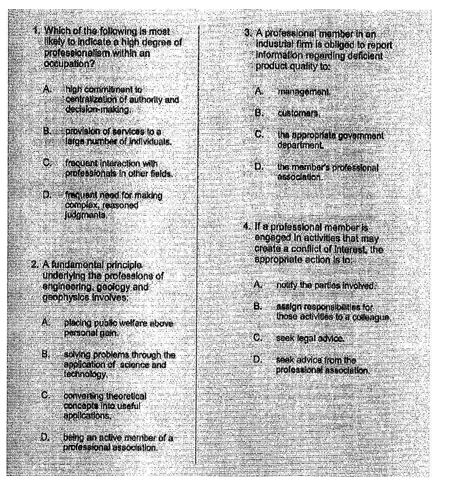
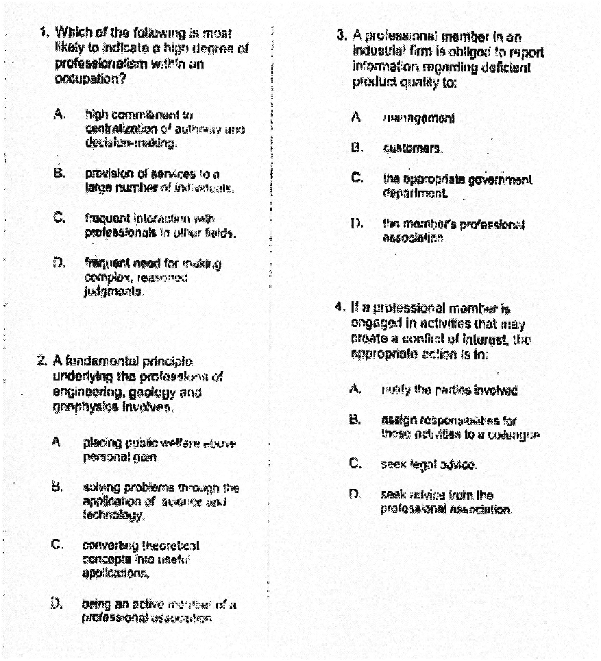

# Text Denoising using Morphology in MatLab

> This answer for this [Question](https://stackoverflow.com/questions/65457647/how-to-remove-the-image-noises-in-this-photo-with-morphology-while-making-the-ba) in StackOverflow.

---

## How to Denoise text in Matlab

> Morhpological Closing
> [Theory Link](https://towardsdatascience.com/image-processing-class-egbe443-6-morphological-filter-e952c1ec886e)


> [Morpho closing Image source](https://homepages.inf.ed.ac.uk/rbf/HIPR2/close.htm)

---

> Matlab Code

```Matlab
% Read Image
img = imread('Noisy_Text.jpg');

% Structuring Element
SE=zeros(3,3);
SE(1,1)=1;
SE(1,3)=1;
SE(2,2)=1;
SE(3,1)=1;
SE(3,3)=1;

% Morphological Closing
Imdilte=imclose(img,SE);

% Plot the Results
figure();
subplot(1,2,1);
imshow(Imdilte)
subplot(1,2,2);
imshow(img);
```

---

### Result



